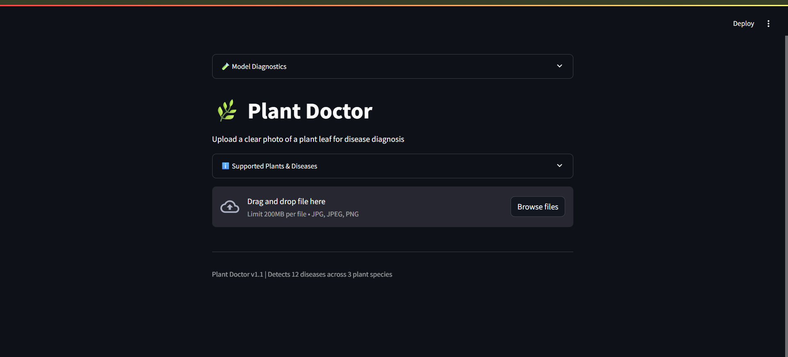
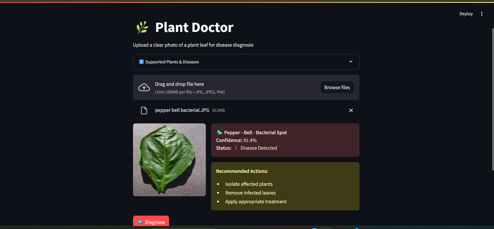

# 🌿 Plant Doctor - Plant Disease Detection using ResNet-18

**Plant Doctor** is a deep learning-powered web app that detects diseases in plant leaves using image classification. It utilizes a custom-trained ResNet-18 model and provides users with an easy-to-use interface through Streamlit.

---

## 🚀 Features

- 🌱 Detects plant diseases from uploaded leaf photos
- ⚙️ Powered by ResNet-18 CNN model
- 🖥️ Clean and interactive Streamlit UI
- 📋 Confidence score and disease-specific recommendations
- 🌿 Supports 3 plant species with 12 disease classes

---

## 📸 Screenshots

### 🧪 Initial UI


### 📷 Sample Diagnosis Output


---

## 🧠 Model Details

- **Model Architecture**: ResNet-18
- **Framework**: PyTorch
- **Accuracy**: ~98.5% (custom trained)

---

## 🛠️ Installation

```bash
git clone https://github.com/Chandachanakya/plant-Doc.git
cd plant-Doc
pip install -r requirements.txt
